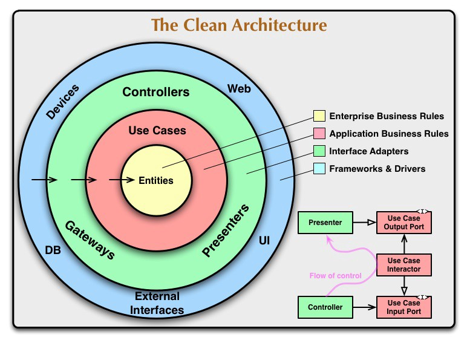

# multi-module-clean-architecture-spring-boot

# Multi Module Clean Architecture with Spring Boot

 

 

## Architecture

###### image from book clean architecture, by Robert C. Martin (also known as Uncle Bob)

## Fundamentals

> Clean Architecture is a software architecture proposed by Robert Cecil Martin (or Uncle Bob, as he is better known) that aims to standardize and organize the code developed, favoring its reusability, as well as technology independence.

## About this project

> Multi-module project developed in Java showcasing an example of the [Clean Architecture](https://blog.cleancoder.com/uncle-bob/2012/08/13/the-clean-architecture.html), intended solely for educational purposes. Built using Gradle.

## Technologies
- Java 17
- Spring Boot 3.2.2
    - spring-boot-starter-web
    - spring-boot-starter-data-jpa
- Lombok (reduces boilerplate code)
- MapStruct (map persistence and domain object)
- H2 (in memory database)
- Tomcat (embedded on spring Boot)
- Git (code versioning)